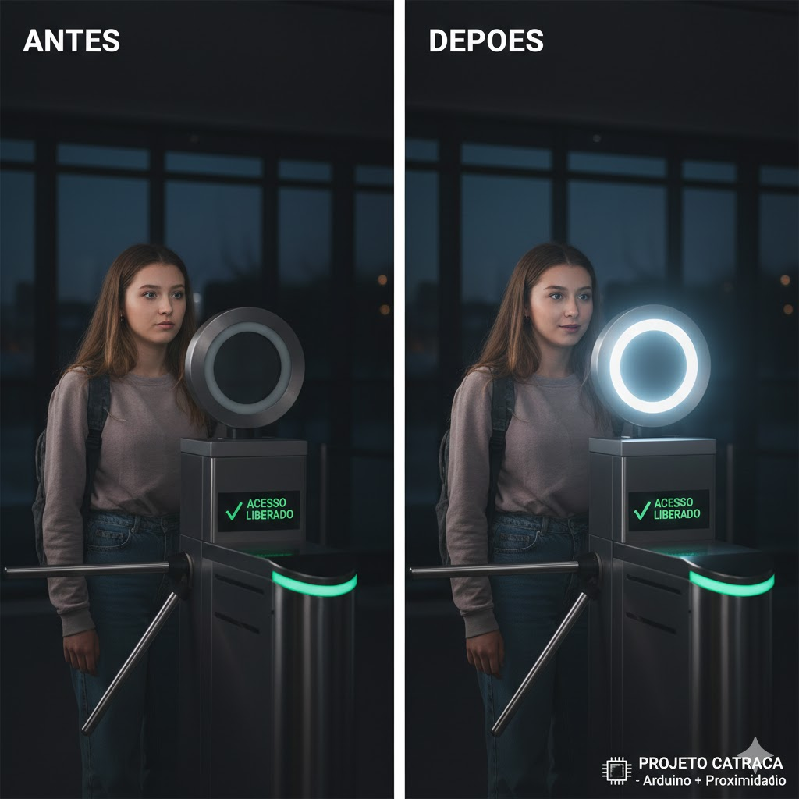
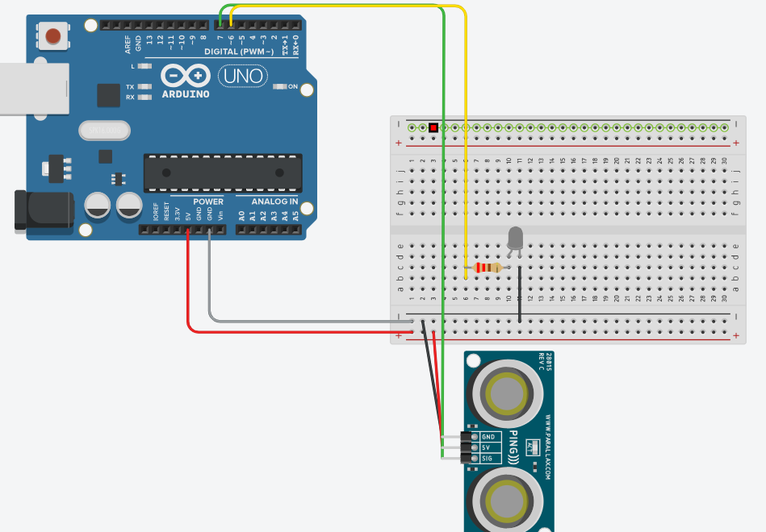

# 🛡️ Sistema de Iluminação Adaptativa para Catraca Facial (Arduino)

Este projeto propõe uma solução para a dificuldade de reconhecimento em **catracas faciais** causada por condições de iluminação inadequadas (ambientes muito escuros ou com contra-luz). Utilizando um sensor de proximidade, o sistema ajusta a **densidade da luz** frontal automaticamente conforme o usuário se aproxima, garantindo a iluminação ideal para a captura do rosto.

---

## 📋 Sumário
* [Visão Geral](#-visão-geral)
* [📸 Demonstração do Impacto](#-demonstração-do-impacto)
* [Componentes Utilizados](#-componentes-utilizados)
* [Esquema de Ligação](#-esquema-de-ligação)
* [Lógica de Funcionamento](#-lógica-de-funcionamento)
* [Como Rodar o Projeto](#-como-rodar-o-projeto)

---

## Autores - 4ESPW
* Gabriela Trevisan (RM99500)
* Breno Silva (RM99275)

---

## 🔍 Visão Geral
Muitos sistemas de biometria facial falham porque o rosto do usuário apresenta sombras ou o ambiente está subexposto. Este protótipo utiliza um sensor ultrassônico para detectar a distância do usuário e, através de **PWM (Pulse Width Modulation)**, aumenta gradualmente o brilho de um anel de LED (ou luz frontal) para iluminar o rosto conforme a pessoa se posiciona para a validação.

---

## 📸 Demonstração do Impacto
O sistema resolve o problema de falha no reconhecimento facial causado por sombras ou luz de fundo excessiva. 

*Esquerda: Ambiente escuro dificultando a detecção facial. Direita: Rosto iluminado e acesso liberado após ativação do sensor.*

---

## 🛠️ Componentes Utilizados

| Componente | Quantidade | Função |
| :--- | :---: | :--- |
| **Arduino Uno/Nano** | 1 | Microcontrolador central |
| **Sensor PING))) (ou HC-SR04)** | 1 | Medição de distância do usuário |
| **LED / Ring Light** | 1 | Iluminação para reconhecimento facial |
| **Resistor 220Ω** | 1 | Proteção do componente de luz |
| **Protoboard & Jumpers** | 1 | Conexões do protótipo |

## 🔌 Esquema de Ligação
As conexões sugeridas para o simulador (Tinkercad) são:

* **Sensor PING))):**
    * `GND` -> GND (Preto)
    * `5V` -> 5V (Vermelho)
    * `SIG` -> Pino Digital **7** (Verde)
* **LED (Iluminação Facial):**
    * `Anodo (+)` -> Resistor 220Ω -> Pino Digital **9** (Saída PWM)
    * `Catodo (-)` -> GND

---

## 🧠 Lógica de Funcionamento
O sistema opera em três estados baseados na distância $d$:

1.  **Standby ($d > 100cm$):** Luz apagada para evitar ofuscamento desnecessário.
2.  **Aproximação ($10 \leq d \leq 100cm$):** O brilho aumenta suavemente conforme o usuário chega perto, preparando a câmera para a captura.
3.  **Reconhecimento ($d < 10cm$):** Brilho máximo estabilizado para garantir a identificação dos traços faciais pela catraca.

> **Cálculo de Distância:**
> A distância é calculada com base no tempo de resposta do som:
> $$cm = \frac{tempo\_do\_pulso}{29 \times 2}$$

---

## 🚀 Como Rodar o Projeto

1.  Acesse o seu painel no [Tinkercad](https://www.tinkercad.com/).
2.  Monte o circuito conforme a seção **Esquema de Ligação**.
3.  Crie um novo arquivo de código e cole a lógica em C++ desenvolvida.
4.  Inicie a simulação.
5.  **Teste:** Clique sobre o sensor azul na simulação e mova a "pessoa" (ponto de distância). Observe o brilho da luz facial variar proporcionalmente.

---

## 💻 Prototipagem Virtual (Tinkercad)

Antes da implementação física, o circuito foi desenvolvido e validado no simulador **Tinkercad**. Isso permitiu ajustar os parâmetros de sensibilidade do sensor ultrassônico e garantir que a curva de dimerização do LED (via PWM) estivesse fluida e funcional.

### Diferenciais da Montagem Virtual:
* **Validação de Sinais:** Verificação do comportamento do pino `SIG` do sensor PING))).
* **Ajuste de PWM:** Calibração dos valores de saída (0-255) para que a luz não estoure a imagem da câmera.
* **Segurança:** Teste de resistências para evitar sobrecarga no pino digital do Arduino.

---

## 📂 Estrutura de Arquivos
* `/src`: Código fonte `.cpp` / `.ino`
* `/assets`: Imagens comparativas e diagramas
* `README.md`: Documentação principal

---

## 🚀 Possíveis Melhorias

Para tornar o sistema ainda mais robusto e profissional, as seguintes implementações são sugeridas:

1.  **Integração com Sensor LDR (Luz Ambiente):**
    * Adicionar um sensor de luminosidade para que o sistema de iluminação só seja ativado se o ambiente estiver realmente escuro. Isso evita o desperdício de energia durante o dia ou em locais já bem iluminados.

2.  **Ajuste de Cor (Temperatura da Luz):**
    * Utilizar LEDs RGB para ajustar a temperatura da cor (branco frio vs. branco quente), otimizando a luz de acordo com a tonalidade da pele do usuário ou a sensibilidade específica da câmera de reconhecimento facial.

3.  **Indicador Visual de Status:**
    * Adicionar LEDs de status (Verde para "Acesso Permitido" e Vermelho para "Erro de Leitura") integrados ao mesmo anel de iluminação, melhorando o feedback visual para o usuário.

4.  **Case com Design Ergonômico:**
    * Desenvolver um suporte impresso em 3D que incline a luz levemente para cima (ângulo de 15º a 30º), evitando o reflexo direto nas lentes da câmera da catraca e iluminando melhor o rosto.